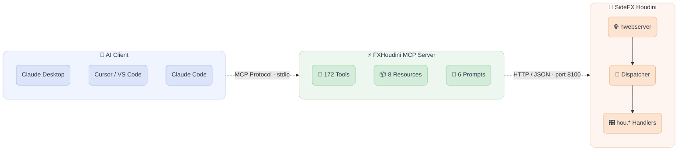

<div align="center">

  
  &nbsp;&nbsp;&nbsp;&nbsp;
  

  <h3 align="center">fxhoudinimcp</h3>

  <p align="center">
    The most comprehensive MCP server for SideFX Houdini.
    <br/>
    172 tools across 21 categories, covering every major Houdini context.
    <br/><br/>
  </p>

  ##

  <p align="center">
    <!-- Maintenance status -->
    &nbsp;&nbsp;
    <!-- License -->
    &nbsp;&nbsp;
    <!-- Last Commit -->
    &nbsp;&nbsp;
    <!-- Commit Activity -->
    <a href="https://github.com/healkeiser/fxhoudinimcp/pulse" alt="Activity">
      </a>&nbsp;&nbsp;
    <!-- PyPI version -->
    <a href="https://pypi.org/project/fxhoudinimcp/">
      </a>&nbsp;&nbsp;
    <!-- PyPI downloads -->
    <a href="https://pepy.tech/projects/fxhoudinimcp"></a> &nbsp;&nbsp;
    <!-- GitHub stars -->
    &nbsp;&nbsp;
  </p>

</div>

<!-- TABLE OF CONTENTS -->
## Table of Contents

- [About](#about)
- [Features](#features)
- [Architecture](#architecture)
- [Installation](#installation)
- [Usage](#usage)
- [Documentation Lookup](#documentation-lookup)
- [Environment Variables](#environment-variables)
- [Development](#development)
- [Contact](#contact)

<!-- ABOUT -->
## About

A comprehensive [MCP](https://modelcontextprotocol.io/) (Model Context Protocol) server for [SideFX Houdini](https://www.sidefx.com/). Connects AI assistants like Claude directly to Houdini's Python API, enabling natural language control over scene building, simulation setup, rendering, and more.

**172 tools**, **8 resources**, and **6 workflow prompts** out of the box.

### What's new in this fork (`nscrdev/fxhoudinimcp`)

- **Version-exact documentation lookup** — four new tools (`get_node_docs`, `search_docs`, `get_vex_function`, `get_doc_page`) that read directly from Houdini's built-in local help server instead of WebFetching `sidefx.com`. The assistant gets reference for *the Houdini build that's actually running*, with no internet dependency. See [Documentation Lookup](#documentation-lookup) below.
- **Optional `markdown` docs backend** via `pip install 'fxhoudinimcp[docs-markdown]'` — default `plain` extractor stays ~10× more token-efficient.
- **Optional `output_path`** on `capture_screenshot`, `capture_network_editor`, `render_viewport`, `render_quad_view`, and `render_node_network` — defaults to a temp directory.
- **Codex skills** for natural-language workflow triggering (see [Installation](#3-configure-your-mcp-client)).

<!-- FEATURES -->
## Features

| Category | Tools | Description |
|----------|-------|-------------|
| **Scene Management** | 7 | Open, save, import/export, scene info |
| **Node Operations** | 16 | Create, delete, copy, connect, layout, flags |
| **Parameters** | 10 | Get/set values, expressions, keyframes, spare parameters |
| **Geometry (SOPs)** | 12 | Points, prims, attributes, groups, sampling, nearest-point search |
| **LOPs/USD** | 18 | Stage inspection, prims, layers, composition, variants, lighting |
| **DOPs** | 8 | Simulation info, DOP objects, step/reset, memory usage |
| **PDG/TOPs** | 10 | Cook, work items, schedulers, dependency graphs |
| **COPs (Copernicus)** | 7 | Image nodes, layers, VDB data |
| **HDAs** | 10 | Create, install, manage Digital Assets and their sections |
| **Animation** | 9 | Keyframes, playbar control, frame range |
| **Rendering** | 9 | Viewport capture, render nodes, settings, render launch |
| **VEX** | 5 | Create/edit wrangles, validate VEX code |
| **Code Execution** | 4 | Python, HScript, expressions, env variables |
| **Viewport/UI** | 11 | Pane management, screenshots, status messages, error detection |
| **Scene Context** | 8 | Network overview, cook chain, selection, scene summary, error analysis |
| **Workflows** | 8 | One-call Pyro/RBD/FLIP/Vellum setup, SOP chains, render config |
| **Materials** | 4 | List, inspect, create materials and shader networks |
| **CHOPs** | 4 | Channel data, CHOP nodes, export channels to parameters |
| **Cache** | 4 | List, inspect, clear, write file caches |
| **Takes** | 4 | List, create, switch takes with parameter overrides |
| **Documentation** | 4 | Fetch node/VEX/page docs and full-text search from Houdini's local help server |

<!-- ARCHITECTURE -->
## Architecture



Uses Houdini's built-in `hwebserver`. No custom socket servers, no rpyc. Uses `hdefereval.executeInMainThreadWithResult()` to safely run `hou.*` calls on the main thread.

<!-- INSTALLATION -->
<!-- --8<-- [start:installation] -->
## Installation

### Requirements

- **Houdini** 20.5+ (tested on 21.0)
- **Python** 3.10+
- **MCP SDK** (`mcp` package) 1.8+

### 1. Install the MCP Server

**From PyPI:**

```shell
pip install fxhoudinimcp
```

**From source:**

```shell
pip install -e .
```

Or with development dependencies:

```shell
pip install -e ".[dev]"
```

### 2. Install the Houdini Plugin

**Option A: Houdini package (recommended)**

1. Copy `houdini/fxhoudinimcp.json` to your Houdini packages directory:
   - Windows: `%USERPROFILE%/Documents/houdiniXX.X/packages/`
   - Linux: `~/houdiniXX.X/packages/`
   - macOS: `~/Library/Preferences/houdini/XX.X/packages/`

2. Edit the JSON file to set `FXHOUDINIMCP` to point to the `houdini` directory in this repo.

**Option B: Manual copy**

Copy the contents of `houdini/` into your Houdini user preferences directory so that:
- `scripts/python/fxhoudinimcp_server/` is on Houdini's Python path
- `python3.Xlibs/uiready.py` auto-starts the server (copy the folder matching your Houdini's Python version)
- `toolbar/fxhoudinimcp.shelf` appears in your shelf

### 3. Configure Your MCP Client

**Claude Desktop** (`claude_desktop_config.json`):

```json
{
  "mcpServers": {
    "fxhoudini": {
      "command": "python",
      "args": ["-m", "fxhoudinimcp"],
      "env": {
        "HOUDINI_HOST": "localhost",
        "HOUDINI_PORT": "8100"
      }
    }
  }
}
```

**Claude Code** (global — available in every project):

```shell
claude mcp add --scope user fxhoudini -- python -m fxhoudinimcp
```

Or to scope it to a single project, add a `.mcp.json` in the project root:

```json
{
  "mcpServers": {
    "fxhoudini": {
      "command": "python",
      "args": ["-m", "fxhoudinimcp"]
    }
  }
}
```

> [!TIP]
> If Claude Desktop reports the server as **disconnected**, replace `"python"` with the
> **full absolute path** to your Python executable. Claude Desktop does not always inherit
> your system PATH. Find it with:
>
> ```shell
> python -c "import sys; print(sys.executable)"
> ```
>
> Then use the result in your config, e.g. `"command": "C:\\Program Files\\Python311\\python.exe"`.
> After any config change, fully quit Claude Desktop (system tray → Quit) and relaunch.

**Codex** (MCP server + repo-scoped skills):

```shell
codex mcp add fxhoudini --env HOUDINI_HOST=localhost --env HOUDINI_PORT=8100 -- python -m fxhoudinimcp
```

This repo also includes Codex skills for natural-language workflow triggering in
[`codex-skill/`](codex-skill/). The repo uses `.agents/skills` as the Codex
discovery path, pointing at that folder so the repo copy stays the source of truth.

Available Codex skills:

- `houdini-procedural-modeling`
- `houdini-simulation`
- `houdini-usd-solaris`
- `houdini-debug-scene`
- `houdini-hda`
- `houdini-pdg`

These complement the MCP server tools:

- The MCP server gives Codex access to Houdini tools, resources, and prompts.
- The Codex skills provide semantic, natural-language workflow triggering without
  requiring an explicit slash-command prompt invocation.
<!-- --8<-- [end:installation] -->

<!-- USAGE -->
## Usage

Launch Houdini normally. The plugin auto-starts once when the UI is ready (controlled by `FXHOUDINIMCP_AUTOSTART` env var). The startup script uses `uiready.py`, which stacks correctly with other Houdini packages. You can also toggle it manually via the **MCP Server** shelf tool.

Once connected, your AI assistant can:

```
"Create a procedural rock generator with mountain displacement"
"Set up a Pyro simulation with a sphere source"
"Build a USD scene with a camera, dome light, and ground plane"
"Create an HDA from the selected subnet"
"Debug why my scene has cooking errors"
```

<!-- DOCUMENTATION LOOKUP -->
## Documentation Lookup

Houdini ships a built-in HTTP help server that serves the same pages as `sidefx.com/docs` but for the **exact Houdini build that's running**. This fork exposes that server through four MCP tools so the assistant can consult node parameters, VEX signatures, and Solaris/Pyro guides without guessing from training data or hitting the public website.

| Tool | Purpose |
|------|---------|
| `get_node_docs(context, node_name)` | Official page for any node (e.g. `Sop`, `scatter`) |
| `search_docs(query, limit)` | Full-text search across the help corpus |
| `get_vex_function(function_name)` | VEX reference by name |
| `get_doc_page(path)` | Arbitrary page (e.g. `/solaris/materials.html`) |

How it works:

- The MCP process discovers the help-server URL once via `hou.helpServerUrl()` (cached for the session, re-discovered on connection failure to survive Houdini restarts).
- Subsequent fetches use `httpx` against `localhost` directly — they bypass Houdini's main thread, so docs still return in ~5 ms during an active cook.
- Default `format="plain"` runs a stdlib HTML→text extractor tuned for Houdini's pages (~98% size reduction, parameters/examples/see-also preserved). Pass `format="markdown"` for human-facing display if you've installed the optional `[docs-markdown]` extra.

The bundled `server_instructions.md` includes a **DOCS-FIRST RULE** telling the assistant to consult these tools before setting unfamiliar parameters or writing VEX workarounds, instead of fabricating from memory.

<!-- ENVIRONMENT VARIABLES -->
## Environment Variables

| Variable | Default | Description |
|----------|---------|-------------|
| `HOUDINI_HOST` | `localhost` | Houdini host address |
| `HOUDINI_PORT` | `8100` | Houdini hwebserver port |
| `FXHOUDINIMCP_PORT` | `8100` | Port for the Houdini plugin to listen on |
| `FXHOUDINIMCP_AUTOSTART` | `1` | Set to `0` to disable auto-start |
| `MCP_TRANSPORT` | `stdio` | MCP transport (`stdio` or `streamable-http`) |
| `LOG_LEVEL` | `INFO` | Logging level |

<!-- DEVELOPMENT -->
## Development

```shell
# Install dev dependencies
pip install -e ".[dev]"

# Run linter
ruff check python/

# Run tests
pytest
```

### How It Works

1. **Houdini Plugin** (`houdini/`): Runs inside Houdini's Python environment. Registers `@hwebserver.apiFunction` endpoints that receive JSON commands. Uses `hdefereval.executeInMainThreadWithResult()` to safely execute `hou.*` calls on the main thread.

2. **MCP Server** (`python/fxhoudinimcp/`): A standalone Python process using FastMCP. Exposes 172 tools, 8 resources, and 6 prompts via the MCP protocol. Forwards tool calls to Houdini over HTTP. Documentation tools fetch from Houdini's local help server directly over `localhost`, bypassing the main thread.

3. **Bridge** (`python/fxhoudinimcp/bridge.py`): Async HTTP client that sends commands to Houdini's hwebserver and deserializes responses. Handles connection errors and timeouts.

<!-- CONTACT -->
## Contact

Project Link: [fxhoudinimcp](https://github.com/healkeiser/fxhoudinimcp)

<p align='center'>
  <!-- GitHub profile -->
  <a href="https://github.com/healkeiser">
    </a>&nbsp;&nbsp;
  <!-- LinkedIn -->
  <a href="https://www.linkedin.com/in/valentin-beaumont">
    </a>&nbsp;&nbsp;
  <!-- Behance -->
  <a href="https://www.behance.net/el1ven">
    </a>&nbsp;&nbsp;
  <!-- X -->
  <a href="https://twitter.com/valentinbeaumon">
    </a>&nbsp;&nbsp;
  <!-- Instagram -->
  <a href="https://www.instagram.com/val.beaumontart">
    </a>&nbsp;&nbsp;
  <!-- Gumroad -->
  <a href="https://healkeiser.gumroad.com/subscribe">
    </a>&nbsp;&nbsp;
  <!-- Gmail -->
  <a href="mailto:valentin.onze@gmail.com">
    </a>&nbsp;&nbsp;
  <!-- Buy me a coffee -->
  <a href="https://www.buymeacoffee.com/healkeiser">
    </a>&nbsp;&nbsp;
</p>

## License

MIT
