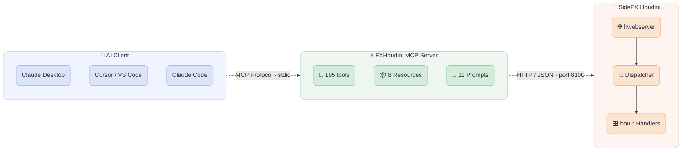

<div align="center">

  
  &nbsp;&nbsp;&nbsp;&nbsp;
  

  <h3 align="center">fxhoudinimcp</h3>

  <p align="center">
    The most comprehensive MCP server for SideFX Houdini.
    <br/>
    195 tools across 24 categories, covering every major Houdini context.
    <br/><br/>
  </p>

  ##

  <p align="center">
    <!-- Maintenance status -->
    &nbsp;&nbsp;
    <!-- License -->
    &nbsp;&nbsp;
    <!-- Last Commit -->
    &nbsp;&nbsp;
    <!-- Commit Activity -->
    <a href="https://github.com/healkeiser/fxhoudinimcp/pulse" alt="Activity">
      </a>&nbsp;&nbsp;
    <!-- PyPI version -->
    <a href="https://pypi.org/project/fxhoudinimcp/">
      </a>&nbsp;&nbsp;
    <!-- PyPI downloads -->
    <a href="https://pepy.tech/projects/fxhoudinimcp"></a> &nbsp;&nbsp;
    <!-- GitHub stars -->
    &nbsp;&nbsp;
  </p>

</div>

<!-- TABLE OF CONTENTS -->
## Table of Contents

- [About](#about)
- [Features](#features)
- [Architecture](#architecture)
- [Installation](#installation)
- [Usage](#usage)
- [Documentation Lookup](#documentation-lookup)
- [Environment Variables](#environment-variables)
- [Development](#development)
- [Contact](#contact)

<!-- ABOUT -->
## About

A comprehensive [MCP](https://modelcontextprotocol.io/) (Model Context Protocol) server for [SideFX Houdini](https://www.sidefx.com/). Connects AI assistants like Claude directly to Houdini's Python API, enabling natural language control over scene building, simulation setup, rendering, and more.

**195 tools**, **8 resources**, and **11 prompts** serving **31 written workflow guides** out of the box.

### What's new in this fork (`nscrdev/fxhoudinimcp`)

- **Version-exact documentation lookup** — four extra tools (`get_node_docs`, `search_docs`, `get_vex_function`, `get_doc_page`) that read directly from Houdini's built-in local help server instead of WebFetching `sidefx.com`. The assistant gets reference for *the Houdini build that's actually running*, with no internet dependency. See [Documentation Lookup](#documentation-lookup) below.
- **Optional `markdown` docs backend** via `pip install 'fxhoudinimcp[docs-markdown]'` — default `plain` extractor stays ~10× more token-efficient.
- **Optional `output_path`** on `capture_screenshot`, `capture_network_editor`, `render_viewport`, `render_quad_view`, and `render_node_network` — defaults to a temp directory.
- **Codex skills** for natural-language workflow triggering (see [Installation](#3-configure-your-mcp-client)).
- **Auto-layout off by default** (`FXHOUDINIMCP_AUTO_LAYOUT=0`) to preserve manual network layouts.

<!-- FEATURES -->
## Features

| Category | Tools | Description |
|----------|-------|-------------|
| **Graph Intelligence** | 6 | Atomic validated network building, network verification, node doc cards, cook profiling, frame-range cooking with per-frame evidence, cook status |
| **Documentation** | 2 | Full-text search + page retrieval over Houdini's own shipped manual (version-exact) |
| **Scene Management** | 7 | Open, save, import/export, scene info |
| **Node Operations** | 17 | Create, delete, copy, connect, layout, flags |
| **Parameters** | 12 | Get/set values in bulk, expressions, keyframes, spare parameters |
| **Geometry (SOPs)** | 14 | Points, prims, attributes, attribute statistics, volume inspection, groups, sampling, nearest-point search |
| **LOPs/USD** | 18 | Stage inspection, prims, layers, composition, variants, lighting |
| **DOPs** | 8 | Simulation info, DOP objects, step/reset, memory usage |
| **PDG/TOPs** | 10 | Cook, work items, schedulers, dependency graphs |
| **COPs (Copernicus)** | 7 | Image nodes, layers, VDB data |
| **HDAs** | 10 | Create, install, manage Digital Assets and their sections |
| **Animation** | 9 | Keyframes, playbar control, frame range |
| **Rendering** | 9 | Viewport capture, render nodes, settings, render launch |
| **VEX** | 5 | Create/edit wrangles, validate VEX code |
| **Code Execution** | 4 | Python, HScript, expressions, env variables |
| **Viewport/UI** | 14 | Pane management, viewer context, verified camera and renderer state, screenshots, error detection |
| **Scene Context** | 8 | Network overview, cook chain, selection, scene summary, error analysis |
| **Workflows** | 8 | One-call Pyro/RBD/FLIP/Vellum setup, SOP chains, render config |
| **Materials** | 5 | List, inspect, create materials and shader networks |
| **CHOPs** | 4 | Channel data, CHOP nodes, export channels to parameters |
| **Cache** | 4 | List, inspect, clear, write file caches |
| **Takes** | 4 | List, create, switch takes with parameter overrides |
| **Documentation** | 4 | Fetch node/VEX/page docs and full-text search from Houdini's local help server |
| **Shelf Tools** | 3 | Find, read and run Houdini's own shelf tools (setups build_network cannot produce) |

<!-- ARCHITECTURE -->
## Architecture


```mermaid
flowchart LR
    subgraph Client[" 🤖 AI Client "]
        direction TB
        A1("Claude Desktop")
        A2("Cursor / VS Code")
        A3("Claude Code")
    end

    subgraph MCP[" ⚡ FXHoudini MCP Server "]
        direction TB
        B1("🔧 195 tools")
        B2("📦 8 Resources")
        B3("💬 11 Prompts")
    end

    subgraph Houdini[" 🔶 SideFX Houdini "]
        direction TB
        C1("🌐 hwebserver")
        C2("📡 Dispatcher")
        C3("🎛️ hou.* Handlers")
        C1 --> C2 --> C3
    end

    Client -. "MCP Protocol · stdio" .-> MCP
    MCP -. "HTTP / JSON · port 8100" .-> Houdini

    classDef clientBox fill:#f0f4ff,stroke:#b8c9e8,stroke-width:1px,color:#2d3748,rx:12,ry:12
    classDef mcpBox fill:#eef6f0,stroke:#a8d5b8,stroke-width:1px,color:#2d3748,rx:12,ry:12
    classDef houdiniBox fill:#fff5f0,stroke:#e8c4a8,stroke-width:1px,color:#2d3748,rx:12,ry:12

    classDef clientNode fill:#dbe4f8,stroke:#96b0dc,stroke-width:1px,color:#2d3748,rx:8,ry:8
    classDef mcpNode fill:#d4edda,stroke:#82c896,stroke-width:1px,color:#2d3748,rx:8,ry:8
    classDef houdiniNode fill:#fde4d0,stroke:#e0a87c,stroke-width:1px,color:#2d3748,rx:8,ry:8

    class Client clientBox
    class MCP mcpBox
    class Houdini houdiniBox
    class A1,A2,A3 clientNode
    class B1,B2,B3 mcpNode
    class C1,C2,C3 houdiniNode
```

Uses Houdini's built-in `hwebserver`. No custom socket servers, no rpyc. Uses `hdefereval.executeInMainThreadWithResult()` to safely run `hou.*` calls on the main thread.

<!-- INSTALLATION -->
<!-- --8<-- [start:installation] -->
## Installation

FXHoudini-MCP has two halves: a **Houdini plugin** that runs inside Houdini, and
an **MCP server** that your AI client starts and which relays to it over
loopback. Both ship in the same Python package, so one install command sets up
both and one upgrade moves them together.

### Requirements

- **Houdini** 20.5+ (integration suite green on 20.5.278, 20.5.487, 20.5.613, 20.5.654, 21.0.440 and 22.0.368)
- **Python** 3.10+, separate from the one inside Houdini
- **MCP SDK** (`mcp` package) 1.8+, installed for you as a dependency

### Install

```shell
pip install fxhoudinimcp
python -m fxhoudinimcp install
```

Then restart Houdini, restart your MCP client, and check the **MCP** menu in
Houdini's menu bar.

`install` does both halves. It writes a Houdini package file pointing at this
exact install, and registers the server with Claude Code and Claude Desktop,
whichever it finds, using the absolute path of the Python you ran it with.

Use `python -m fxhoudinimcp install` rather than the bare `fxhoudinimcp install`
if you have more than one Python. Both work, but the module form is
self-correcting: whichever interpreter runs it is the one written into your
client config, so if the command runs at all, the path it registers is correct.

Add `--dry-run` first if you want to see every file it would touch and change
nothing.

It asks nothing and it finishes. If you have several Houdini versions, it writes
into every packages directory it finds:

```
Houdini plugin
  Wrote C:\Users\you\Documents\houdini21.0\packages\fxhoudinimcp.json
  Wrote C:\Users\you\Documents\houdini22.0\packages\fxhoudinimcp.json
```

That is safe rather than lazy. The files are identical and point at the same
plugin, so whichever directory your Houdini reads, it finds a correct one. It
also settles the Windows case where OneDrive's Documents redirection makes a
desktop-launched Houdini and a shell-launched one disagree: both paths get a
file, so both work. The cost is an **MCP** menu in a Houdini version you may not
use, which `uninstall` clears in one go.

Because it never stops to ask, the same command works unchanged from a terminal,
from Houdini's MCP menu, or from a setup script. To target one directory only:

```shell
python -m fxhoudinimcp install --houdini-dir "~/Documents/houdini22.0/packages"
```

If your MCP client already has an `fxhoudini` entry pointing at a different
interpreter, it is repointed at this one and the old value is printed. That is
the common case after switching Python versions or recreating a virtualenv.

| Flag | What it does |
| --- | --- |
| `--dry-run` | Report every change, make none |
| `--houdini-dir DIR` | Which packages directory to write into |
| `--client-only` | Register a client, leave Houdini untouched. Needs no packages directory, so it works when several exist |
| `--client auto\|claude-code\|claude-desktop\|both\|none` | Which client to register. `none` if you wire it up yourself |

Upgrading later moves both halves at once, because the plugin lives inside the
wheel:

```shell
pip install --upgrade fxhoudinimcp
```

The one thing to know: if you told Houdini to load the plugin from a **git
clone** instead of the installed package (see [by hand](#installing-by-hand)),
`pip install --upgrade` will not move that half. Those two halves are then
independent, and the server warns at startup when it finds a plugin older than
itself.

### Uninstalling

`pip uninstall` moves neither half. The Houdini package file and the client
registration both outlive it, and both fail quietly once the package is gone: a
package file pointing at a plugin directory that no longer exists is skipped by
Houdini without a word, and a stale client entry shows up only as
"disconnected". So take the two halves out first, then the package:

```shell
python -m fxhoudinimcp uninstall
pip uninstall fxhoudinimcp
```

`uninstall` lists everything it found and asks before removing any of it. Unlike
`install` it does not need to know which Houdini you meant: every
`fxhoudinimcp.json` it finds is a leftover, and the one you forget is exactly
what silently overrides your next install. Narrow it with `--houdini-dir` when
you only want one Houdini cleaned.

| Flag | What it removes |
| --- | --- |
| `--dry-run` | Nothing. Lists what it would remove |
| `--houdini-dir DIR` | Only this packages directory, instead of every one found |
| `--client-only` | Only the client registration, leaving the package files |
| `--client auto\|claude-code\|claude-desktop\|both\|none` | Which client to unregister from |
| `--yes` | Skip the confirmation. Required when stdin is not a terminal |

### Configuring the plugin

The package file `install` writes is also where the Houdini-side settings live.
It ships every one of them at its default, so they are all visible in one place:
`FXHOUDINIMCP_PORT`, `FXHOUDINIMCP_BIND`, `FXHOUDINIMCP_AUTOSTART` and
`FXHOUDINIMCP_AUTO_LAYOUT` (see [Environment Variables](#environment-variables)
for what each does). Two things to know:

- Because the package sets these explicitly, it **wins over the same variable
  set in your shell**. Change them here, not in your environment. Houdini's
  package format has no "only if unset" method, and it rejects JSON comments,
  so there is no way to ship them inert.
- `HOUDINI_HOST`, `HOUDINI_PORT`, `MCP_TRANSPORT` and `LOG_LEVEL` do **not**
  belong here. They are read by the MCP server process that your client
  launches, not by Houdini, so setting them in this file has no effect --
  configure those in your MCP client instead. If you change
  `FXHOUDINIMCP_PORT`, set `HOUDINI_PORT` to match on the client side.

Note that pinning `HOUDINI_PORT` on the client switches off the port scan. A
second Houdini moves itself to the next free port, and the client normally finds
it by scanning 8100-8115 and taking the lowest that answers. Pin it only when you
want one specific session.

### Installing by hand

`install` is the recommended route and the rest of this section is the manual
equivalent, for contributors working from a clone, locked-down machines, or when
something needs untangling. It is the same two halves.

#### 1. Point Houdini at the plugin

```shell
fxhoudinimcp houdini-package
```

That prints the package file with the plugin path filled in for *this* install,
plus the Houdini packages directories found on your machine. Write it with:

```shell
fxhoudinimcp houdini-package --write "~/Documents/houdini22.0/packages"
```

Do not type the plugin path by hand. It lives inside the Python environment you
installed into, so it changes if you recreate a virtualenv, switch to uv or
pipx, or move between Python versions, and Houdini says nothing when a package
path stops resolving. `--path-only` prints just the path for scripting.

Like `install`, this deliberately does not pick a packages directory for you, and
it warns if another `fxhoudinimcp.json` exists elsewhere, because Houdini
processes every packages directory and lets the last one win. That is how a stale
clone silently overrides a fresh install.

**Pointing at a clone instead.** Contributors, or anyone wanting the plugin
tracked by git, can write the package file against a checkout:

```json
{ "env": [ { "FXHOUDINIMCP": "C:/Users/you/code/fxhoudinimcp/houdini" } ],
  "path": "$FXHOUDINIMCP" }
```

Forward slashes work on every platform. The path must end in `/houdini` and must
contain `scripts/`, `MainMenuCommon.xml` and the `python3.Xlibs/` folders. Do not
do this *and* the CLI, or the two package files will fight. Remember that
`pip install --upgrade` cannot move a clone.

> [!NOTE]
> Copying `houdini/` into your Houdini preferences directory also works, but it
> is not recommended: `pip` cannot update a copy, so the plugin drifts behind the
> server, which is the skew the startup compatibility warning exists to catch.
> Use a package file so there is one copy of the plugin.

#### 2. Point your MCP client at the server

Both examples need the **absolute path** to the Python that has `fxhoudinimcp`
installed. Clients start their servers without your shell environment, so a bare
`python` resolves against a PATH they may not share, and the only symptom is the
client reporting **disconnected** with nothing explaining why. Find the path
with:

```shell
python -c "import sys; print(sys.executable)"
```

**Claude Code** (user scope, available in every project):

```shell
claude mcp add --scope user fxhoudini -- "C:\Program Files\Python311\python.exe" -m fxhoudinimcp
```

There is no in-place update. To repoint an existing entry, remove it first:

```shell
claude mcp remove fxhoudini -s user
```

**Claude Desktop** (`claude_desktop_config.json`):

```json
{
  "mcpServers": {
    "fxhoudini": {
      "command": "C:\\Program Files\\Python311\\python.exe",
      "args": ["-m", "fxhoudinimcp"]
    }
  }
}
```

After any change, fully quit Claude Desktop (system tray → Quit) and relaunch;
closing the window is not enough.

To scope the server to a single project instead, add a `.mcp.json` in the project
root with the same `mcpServers` block.

`python -m fxhoudinimcp install --client-only` does this step for you, with the
right path already filled in, and leaves the Houdini side alone. **MCP > Connect
a Client...** inside Houdini prints the same command along with the port that
session actually ended up on.

### When Houdini does not load the plugin

No **MCP** menu means the package file was skipped, and Houdini does that
without printing anything. Start it with the package log enabled and look for
your file:

```shell
# Windows (PowerShell)
$env:HOUDINI_PACKAGE_VERBOSE=1; houdini
# Linux / macOS
HOUDINI_PACKAGE_VERBOSE=1 houdini
```

A working package prints both a `Loading:` and a `Processing:` line for
`fxhoudinimcp.json`. Three ways this fails quietly:

- **A path that does not exist.** Houdini skips the package and says nothing.
  Nothing loads: no menu, no auto-start, no `fxhoudinimcp_server` module.
- **A UTF-8 BOM.** Houdini's JSON parser rejects a leading BOM and skips the
  whole package. On Windows, `Set-Content -Encoding UTF8` adds one; use
  `-Encoding utf8NoBOM` (PowerShell 7+) or an editor that can save without one.
  The file looks correct either way, which is what makes this one nasty. Both
  `install` and `houdini-package` write without a BOM.
- **A second `fxhoudinimcp.json`.** Houdini processes every packages directory
  and the last one wins, so a leftover file can override a fresh install. Both
  commands warn when they find another one. `fxhoudinimcp houdini-package` lists
  every one it can see, and what each points at, and `fxhoudinimcp uninstall`
  removes the lot.
- **No package file for the Houdini you launched.** Each Houdini version reads
  its own preference directory, so a file in `houdini21.0/packages` does nothing
  for a Houdini 22 you start afterwards. `install` writes to every candidate for
  exactly this reason; you only see this if you narrowed it with
  `--houdini-dir`, or if that Houdini's `packages` directory did not exist when
  you ran it. Create it and re-run.

On Windows, note that OneDrive's Documents redirection means a desktop-launched
Houdini and a shell-launched one can resolve different preference directories.
The package log is what settles which one your Houdini actually reads.

### Checking what you are actually running

An editable install reports the version it was created at, not whatever the
working tree has become since, so an old checkout can be running while the
metadata claims otherwise:

```shell
python -m fxhoudinimcp --version
```

Worth checking first whenever a documented subcommand behaves as though it does
not exist. Before 2.5.0, an unrecognised argument was ignored and the MCP server
started instead, so `python -m fxhoudinimcp install` on an older install printed
a warning about not reaching Houdini and then sat there, looking like a hung
installer. It now exits with `unknown command` and the list of real ones.

**Codex** (MCP server + repo-scoped skills):

```shell
codex mcp add fxhoudini --env HOUDINI_HOST=localhost --env HOUDINI_PORT=8100 -- python -m fxhoudinimcp
```

This repo also includes Codex skills for natural-language workflow triggering in
[`codex-skill/`](codex-skill/). The repo uses `.agents/skills` as the Codex
discovery path, pointing at that folder so the repo copy stays the source of truth.

Available Codex skills:

- `houdini-procedural-modeling`
- `houdini-simulation`
- `houdini-usd-solaris`
- `houdini-debug-scene`
- `houdini-hda`
- `houdini-pdg`
- `houdini-omniverse-prep`
- `houdini-cleanup`

These complement the MCP server tools:

- The MCP server gives Codex access to Houdini tools, resources, and prompts.
- The Codex skills provide semantic, natural-language workflow triggering without
  requiring an explicit slash-command prompt invocation.

<!-- --8<-- [end:installation] -->

<!-- USAGE -->
## Usage

Launch Houdini normally. The plugin auto-starts once when the UI is ready (controlled by `FXHOUDINIMCP_AUTOSTART` env var). The startup script uses `uiready.py`, which stacks correctly with other Houdini packages. You can also control it manually from the **MCP** menu (Start Server, Stop Server, Connect a Client, Server Status).

**MCP > Connect a Client...** prints the `claude mcp add` line for the port this
session actually ended up on, and copies it to the clipboard. That matters with
more than one Houdini open: a second session moves itself to the next free port,
so the configured port and the real one differ.

Startup verifies that Houdini's `mcp.health` endpoint answers from the current
Houdini process before printing that the server is ready. If your assistant
cannot reach Houdini after an app restart, call `get_houdini_connection_status`
for structured diagnostics, then relaunch Houdini or align `FXHOUDINIMCP_PORT`
and `HOUDINI_PORT` if another process owns the port.

Once connected, your AI assistant can:

```
"Create a procedural rock generator with mountain displacement"
"Set up a Pyro simulation with a sphere source"
"Build a USD scene with a camera, dome light, and ground plane"
"Create an HDA from the selected subnet"
"Debug why my scene has cooking errors"
```

<!-- DOCUMENTATION LOOKUP -->
## Documentation Lookup

Houdini ships a built-in HTTP help server that serves the same pages as `sidefx.com/docs` but for the **exact Houdini build that's running**. This fork exposes that server through four MCP tools so the assistant can consult node parameters, VEX signatures, and Solaris/Pyro guides without guessing from training data or hitting the public website.

| Tool | Purpose |
|------|---------|
| `get_node_docs(context, node_name)` | Official page for any node (e.g. `Sop`, `scatter`) |
| `search_docs(query, limit)` | Full-text search across the help corpus |
| `get_vex_function(function_name)` | VEX reference by name |
| `get_doc_page(path)` | Arbitrary page (e.g. `/solaris/materials.html`) |

How it works:

- The MCP process discovers the help-server URL once via `hou.helpServerUrl()` (cached for the session, re-discovered on connection failure to survive Houdini restarts).
- Subsequent fetches use `httpx` against `localhost` directly — they bypass Houdini's main thread, so docs still return in ~5 ms during an active cook.
- Default `format="plain"` runs a stdlib HTML→text extractor tuned for Houdini's pages (~98% size reduction, parameters/examples/see-also preserved). Pass `format="markdown"` for human-facing display if you've installed the optional `[docs-markdown]` extra.

The bundled `server_instructions.md` includes a **DOCS-FIRST RULE** telling the assistant to consult these tools before setting unfamiliar parameters or writing VEX workarounds, instead of fabricating from memory.

<!-- ENVIRONMENT VARIABLES -->
## Environment Variables

| Variable | Default | Description |
|----------|---------|-------------|
| `HOUDINI_HOST` | `localhost` | Houdini host address |
| `HOUDINI_PORT` | `8100` | Houdini hwebserver port |
| `FXHOUDINIMCP_PORT` | `8100` | Port for the Houdini plugin to listen on |
| `FXHOUDINIMCP_AUTOSTART` | `1` | Set to `0` to disable auto-start |
| `FXHOUDINIMCP_AUTO_LAYOUT` | `0` | Disabled by default in this fork (preserves manual layouts); set to `1` to allow automatic node layout |
| `FXHOUDINIMCP_BIND` | `127.0.0.1` | Address the Houdini plugin binds. Loopback by default: the bridge runs arbitrary Python in your Houdini session and has no authentication, so only widen this on a network you trust |
| `MCP_TRANSPORT` | `stdio` | MCP transport (`stdio` or `streamable-http`) |
| `LOG_LEVEL` | `INFO` | Logging level |

<!-- DEVELOPMENT -->
## Development

```shell
# Install dev dependencies
pip install -e ".[dev]"

# Run linter
ruff check python/

# Run tests
pytest

# Run integration tests inside a real Houdini (requires a license seat;
# uses the newest installed Houdini, override with the HYTHON env var).
# Works on Windows, macOS, and Linux:
python tests/run_integration.py
# Convenience wrappers: tests/run_integration.ps1 / tests/run_integration.sh

# Contribute this machine's Houdini builds to the node-availability table and
# regenerate the version annotations in server_instructions.md:
python tools/gen_node_versions.py
# Regenerate the derived search hints and the plugin-command manifest
# (run gen_node_domains after gen_node_versions, it reads that table):
python tools/gen_node_domains.py
python tools/gen_required_commands.py
# Regenerate the node vocabulary tables in the workflow prompts. Edit the
# groupings in tools/prompt_vocab.json, never the tables in the markdown:
python tools/gen_prompt_vocab.py
python tools/gen_node_versions.py --check   # verify the table against this machine
python tools/gen_prompt_vocab.py --check    # needs no Houdini; runs in tests too
HYTHON=/path/to/hython python tools/gen_node_versions.py   # one specific build
```

No node name in `prompts/markdown/` is hand-written any more. The tables come
from `tools/prompt_vocab.json` through `gen_prompt_vocab.py`, which rejects a
name no sampled build has and dates the ones that exist in only part of the
20.5-22.0 range. `tests/test_prompt_vocab.py` enforces both, and also checks the
hand-written prose around the tables, since that names nodes too, plus that every
shipped help page the prompts cite still resolves.

### Prompt file layout

`prompts/markdown/` has three subdirectories, so what a file is for is visible at
every call site (`load_markdown("workflows/pyro.md")`):

- `instructions/` — what the server tells every client at connect time.
- `workflows/` — one guide per subject, **named after the SideFX help scope it draws on**, so `pyro.md` pairs with the `pyro/` manual and `solaris.md` with `solaris/`. 31 of them.
- `shared/` — fragments injected into the above (`housekeeping.md`, `layout_on.md`, `layout_off.md`), never served alone.

Most subjects are reached through `houdini_workflow(topic)`, where `topic` is the
scope name, so adding a subject means adding a markdown file and nothing else. `simulation_setup` dispatches on its `sim_type` argument
through an alias map, because SideFX files FLIP under `fluid/` and RBD under
`destruction/` while users ask for "flip" and "rbd"; anything with no specific
guide falls back to `dyno.md`, the general dynamics one.

The server searches **every** help corpus the install ships, zipped or loose. On
a full 22.0 that is 56 scopes and 11,451 pages, including the workflow manuals
(`pyro/`, `fluid/`, `vellum/`, `destruction/`, `model/`, `assets/`, `copy/`) and
the unzipped ones (`copernicus/`, `mpm/`, `heightfields/`, `ml/`). It costs about
half a second of lazy load and ~69 MB inside Houdini, and nothing in the
assistant's context until a lookup happens.

`tools/node_versions.json` accumulates. It records which builds have been
sampled and what node types each had, so **one installed Houdini is enough**:
your build merges into the shared evidence and the annotations are derived from
everything sampled so far. A contributor with a single Houdini produces exactly
the same table as someone with six. If a version has never been sampled by
anyone, the generator says so rather than guessing, and `--check` reports only
contradictions with the builds you actually have.

That evidence file is ~1 MB and is **not** shipped. The generator also writes
`python/fxhoudinimcp/data/sampled_versions.json`, a few hundred bytes listing
only which versions have been sampled, which does ship: the server compares the
connected Houdini against it at startup and warns when a version has never been
checked, so a marker like `(21.0+)` silently covering a future 23.0 becomes
visible instead. `get_houdini_connection_status` reports the same thing. It is
advisory: `build_network(dry_run=True)` validates node types against the running
Houdini and cannot go stale.

If Red Giant / Maxon Universe is installed, its OpenFX plug-in crashes `hou`
initialisation on Houdini 20.5.487 and later, so `hython` cannot start at all.
Set `HOUDINI_DISABLE_OPENFX_DEFAULT_PATH=1` when running any of the above.
This is a Houdini/Universe conflict, not something this repo causes.

Unit tests mock `hou` and run anywhere. The integration suite in
`tests/integration/` executes all 188 commands against live Houdini via
`hython` — including end-to-end user scenarios (procedural modeling,
simulation, animation, lookdev) — and prints per-command timing and
coverage reports; it is skipped automatically when `hou` is not
available. `tests/integration/perf_sweep.py` benchmarks handlers on
large scenes, and `python tests/integration/bridge_e2e.py` validates the
full HTTP transport (real hwebserver in hython driven by the MCP
server's own bridge).

### How It Works

1. **Houdini Plugin** (`houdini/`): Runs inside Houdini's Python environment. Registers `@hwebserver.apiFunction` endpoints that receive JSON commands. Uses `hdefereval.executeInMainThreadWithResult()` to safely execute `hou.*` calls on the main thread.

2. **MCP Server** (`python/fxhoudinimcp/`): A standalone Python process using FastMCP. Exposes 195 tools, 8 resources, and 11 prompts via the MCP protocol. Forwards tool calls to Houdini over HTTP. Documentation tools fetch from Houdini's local help server directly over `localhost`, bypassing the main thread.

3. **Bridge** (`python/fxhoudinimcp/bridge.py`): Async HTTP client that sends commands to Houdini's hwebserver and deserializes responses. Handles connection errors and timeouts.

#### What a call costs

That main-thread hop in step 1 is not free, and it is the single biggest thing
to know when driving this. `hou.*` can only run on Houdini's main thread, so
every command is queued with `hdefereval` and waits for the next event-loop
tick. Measured on Houdini 22.0.368 with an idle scene:

| | |
| --- | --- |
| `health_check` (answers on the web server thread, no main-thread hop) | 0.5 ms |
| any real command, including `list_children` on an **empty** `/obj` | ~50 ms |
| 10 nodes created one call at a time | ~800 ms |
| the same 10 nodes in a single round trip | ~66 ms |

The floor is flat: a trivial query costs the same as a real one, because you are
paying for the tick, not the work. So the cost of a session is set by how many
calls it makes, not how much they each do, and batching is worth roughly an
order of magnitude rather than being a matter of neatness. That is why the
server instructions tell an assistant to design a whole graph and submit it as
one `build_network`, and why `set_parameters`, `connect_nodes_batch` and
`verify_network` exist alongside their single-item equivalents.

Numbers are from one Windows machine and will move with hardware and with how
busy Houdini is; the ratio is the durable part.

<!-- CONTACT -->
## Contact

Project Link: [fxhoudinimcp](https://github.com/healkeiser/fxhoudinimcp)

<p align='center'>
  <!-- GitHub profile -->
  <a href="https://github.com/healkeiser">
    </a>&nbsp;&nbsp;
  <!-- LinkedIn -->
  <a href="https://www.linkedin.com/in/valentin-beaumont">
    </a>&nbsp;&nbsp;
  <!-- Behance -->
  <a href="https://www.behance.net/el1ven">
    </a>&nbsp;&nbsp;
  <!-- X -->
  <a href="https://twitter.com/valentinbeaumon">
    </a>&nbsp;&nbsp;
  <!-- Instagram -->
  <a href="https://www.instagram.com/val.beaumontart">
    </a>&nbsp;&nbsp;
  <!-- Gumroad -->
  <a href="https://healkeiser.gumroad.com/subscribe">
    </a>&nbsp;&nbsp;
  <!-- Gmail -->
  <a href="mailto:valentin.onze@gmail.com">
    </a>&nbsp;&nbsp;
  <!-- Buy me a coffee -->
  <a href="https://www.buymeacoffee.com/healkeiser">
    </a>&nbsp;&nbsp;
</p>

## License

MIT
